# Mermaid 图表全面详细案例教程

## 目录
1. [流程图 Flowchart](#1-流程图-flowchart)
2. [时序图 Sequence Diagram](#2-时序图-sequence-diagram)
3. [类图 Class Diagram](#3-类图-class-diagram)
4. [状态图 State Diagram](#4-状态图-state-diagram)
5. [甘特图 Gantt Chart](#5-甘特图-gantt-chart)
6. [饼图 Pie Chart](#6-饼图-pie-chart)
7. [思维导图 Mindmap](#7-思维导图-mindmap)
8. [Git 图 Git Graph](#8-git-图-git-graph)
9. [实体关系图 ER Diagram](#9-实体关系图-er-diagram)
10. [用户旅程图 User Journey](#10-用户旅程图-user-journey)

---

## 1. 流程图 Flowchart

### 基础语法

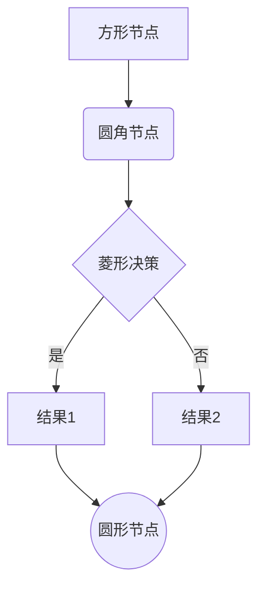
```mermaid
flowchart TD
    A[方形节点] --> B(圆角节点)
    B --> C{菱形决策}
    C -->|是| D[结果1]
    C -->|否| E[结果2]
    D --> F((圆形节点))
    E --> F
```

### 节点形状

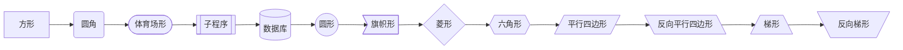
```mermaid
flowchart LR
    A[方形] --> B(圆角)
    B --> C([体育场形])
    C --> D[[子程序]]
    D --> E[(数据库)]
    E --> F((圆形))
    F --> G>旗帜形]
    G --> H{菱形}
    H --> I{{六角形}}
    I --> J[/平行四边形/]
    J --> K[\反向平行四边形\]
    K --> L[/梯形\]
    L --> M[\反向梯形/]
```

### 箭头类型

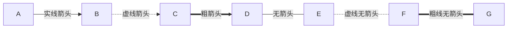
```mermaid
flowchart LR
    A -->|实线箭头| B
    B -.->|虚线箭头| C
    C ==>|粗箭头| D
    D ---|无箭头| E
    E -.-|虚线无箭头| F
    F ===|粗线无箭头| G
```

### 复杂流程图示例：交易系统

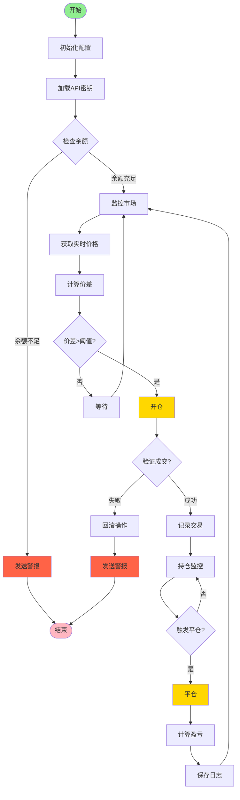
```mermaid
flowchart TD
    Start([开始]) --> Init[初始化配置]
    Init --> LoadAPI[加载API密钥]
    LoadAPI --> CheckBalance{检查余额}
    
    CheckBalance -->|余额充足| Monitor[监控市场]
    CheckBalance -->|余额不足| Alert1[发送警报]
    Alert1 --> End([结束])
    
    Monitor --> GetPrice[获取实时价格]
    GetPrice --> CalcSpread[计算价差]
    CalcSpread --> Decision{价差>阈值?}
    
    Decision -->|是| OpenPosition[开仓]
    Decision -->|否| Wait[等待]
    Wait --> Monitor
    
    OpenPosition --> Verify{验证成交?}
    Verify -->|成功| Record[记录交易]
    Verify -->|失败| Rollback[回滚操作]
    Rollback --> Alert2[发送警报]
    
    Record --> HoldPosition[持仓监控]
    HoldPosition --> CheckExit{触发平仓?}
    
    CheckExit -->|是| ClosePosition[平仓]
    CheckExit -->|否| HoldPosition
    
    ClosePosition --> CalcProfit[计算盈亏]
    CalcProfit --> SaveLog[保存日志]
    SaveLog --> Monitor
    
    Alert2 --> End
    
    style Start fill:#90EE90
    style End fill:#FFB6C1
    style OpenPosition fill:#FFD700
    style ClosePosition fill:#FFD700
    style Alert1 fill:#FF6347
    style Alert2 fill:#FF6347
```

### 子图示例

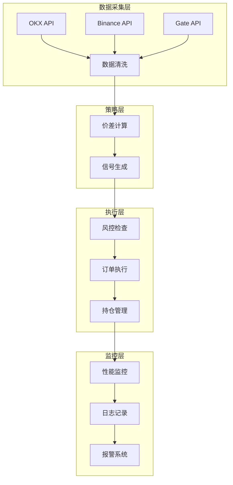
```mermaid
flowchart TB
    subgraph 数据采集层
        A[OKX API] --> D[数据清洗]
        B[Binance API] --> D
        C[Gate API] --> D
    end
    
    subgraph 策略层
        D --> E[价差计算]
        E --> F[信号生成]
    end
    
    subgraph 执行层
        F --> G[风控检查]
        G --> H[订单执行]
        H --> I[持仓管理]
    end
    
    subgraph 监控层
        I --> J[性能监控]
        J --> K[日志记录]
        K --> L[报警系统]
    end
```

---

## 2. 时序图 Sequence Diagram

### 基础语法

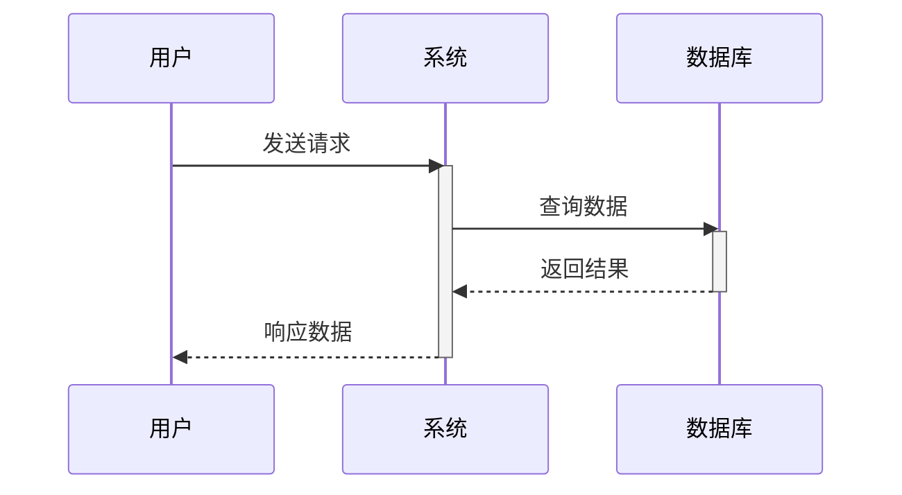
```mermaid
sequenceDiagram
    participant A as 用户
    participant B as 系统
    participant C as 数据库
    
    A->>B: 发送请求
    activate B
    B->>C: 查询数据
    activate C
    C-->>B: 返回结果
    deactivate C
    B-->>A: 响应数据
    deactivate B
```

### 复杂时序图：套利交易流程

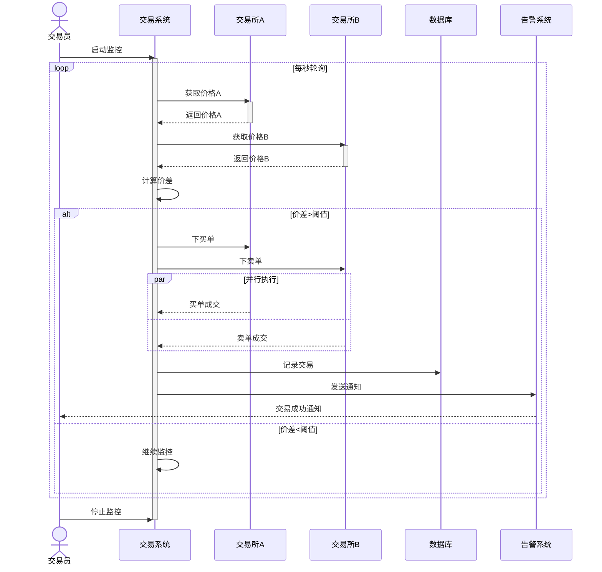
```mermaid
sequenceDiagram
    actor User as 交易员
    participant System as 交易系统
    participant ExA as 交易所A
    participant ExB as 交易所B
    participant DB as 数据库
    participant Alert as 告警系统
    
    User->>System: 启动监控
    activate System
    
    loop 每秒轮询
        System->>ExA: 获取价格A
        activate ExA
        ExA-->>System: 返回价格A
        deactivate ExA
        
        System->>ExB: 获取价格B
        activate ExB
        ExB-->>System: 返回价格B
        deactivate ExB
        
        System->>System: 计算价差
        
        alt 价差>阈值
            System->>ExA: 下买单
            System->>ExB: 下卖单
            
            par 并行执行
                ExA-->>System: 买单成交
            and
                ExB-->>System: 卖单成交
            end
            
            System->>DB: 记录交易
            System->>Alert: 发送通知
            Alert-->>User: 交易成功通知
        else 价差<阈值
            System->>System: 继续监控
        end
    end
    
    User->>System: 停止监控
    deactivate System
```

### 带注释的时序图

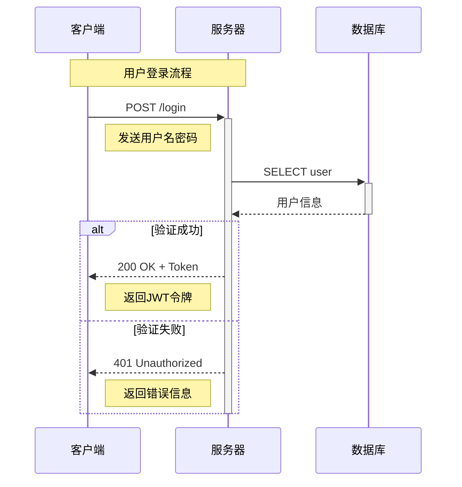
```mermaid
sequenceDiagram
    participant C as 客户端
    participant S as 服务器
    participant D as 数据库
    
    Note over C,S: 用户登录流程
    C->>+S: POST /login
    Note right of C: 发送用户名密码
    
    S->>+D: SELECT user
    D-->>-S: 用户信息
    
    alt 验证成功
        S-->>C: 200 OK + Token
        Note left of S: 返回JWT令牌
    else 验证失败
        S-->>C: 401 Unauthorized
        Note left of S: 返回错误信息
    end
    
    deactivate S
```

---

## 3. 类图 Class Diagram

### 基础语法

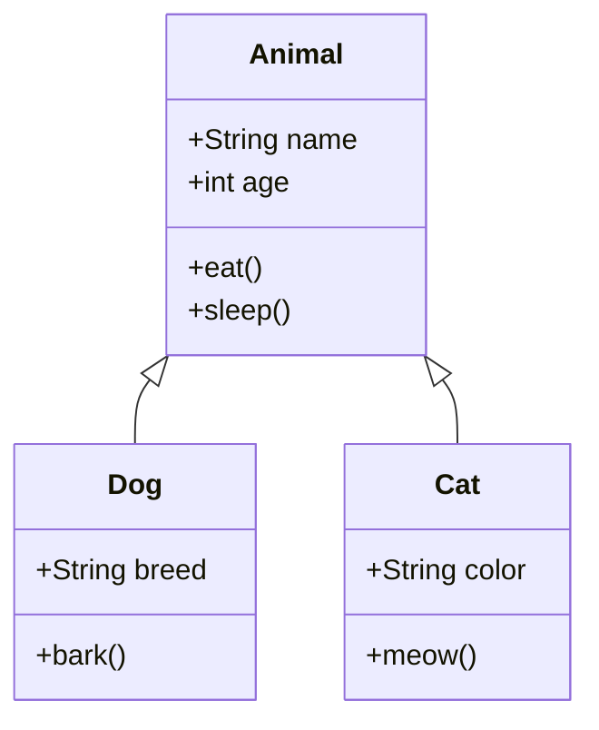
```mermaid
classDiagram
    class Animal {
        +String name
        +int age
        +eat()
        +sleep()
    }
    
    class Dog {
        +String breed
        +bark()
    }
    
    class Cat {
        +String color
        +meow()
    }
    
    Animal <|-- Dog
    Animal <|-- Cat
```

### 复杂类图：交易系统架构

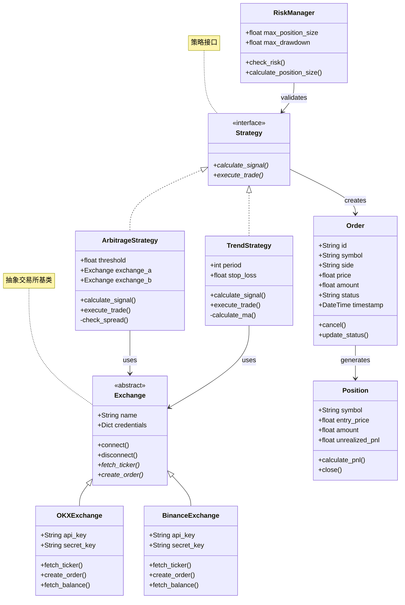
```mermaid
classDiagram
    class Exchange {
        <<abstract>>
        +String name
        +Dict credentials
        +connect()
        +disconnect()
        +fetch_ticker()*
        +create_order()*
    }
    
    class OKXExchange {
        +String api_key
        +String secret_key
        +fetch_ticker()
        +create_order()
        +fetch_balance()
    }
    
    class BinanceExchange {
        +String api_key
        +String secret_key
        +fetch_ticker()
        +create_order()
        +fetch_balance()
    }
    
    class Strategy {
        <<interface>>
        +calculate_signal()*
        +execute_trade()*
    }
    
    class ArbitrageStrategy {
        +float threshold
        +Exchange exchange_a
        +Exchange exchange_b
        +calculate_signal()
        +execute_trade()
        -check_spread()
    }
    
    class TrendStrategy {
        +int period
        +float stop_loss
        +calculate_signal()
        +execute_trade()
        -calculate_ma()
    }
    
    class Order {
        +String id
        +String symbol
        +String side
        +float price
        +float amount
        +String status
        +DateTime timestamp
        +cancel()
        +update_status()
    }
    
    class Position {
        +String symbol
        +float entry_price
        +float amount
        +float unrealized_pnl
        +calculate_pnl()
        +close()
    }
    
    class RiskManager {
        +float max_position_size
        +float max_drawdown
        +check_risk()
        +calculate_position_size()
    }
    
    Exchange <|-- OKXExchange
    Exchange <|-- BinanceExchange
    Strategy <|.. ArbitrageStrategy
    Strategy <|.. TrendStrategy
    ArbitrageStrategy --> Exchange : uses
    TrendStrategy --> Exchange : uses
    Strategy --> Order : creates
    Order --> Position : generates
    RiskManager --> Strategy : validates
    
    note for Exchange "抽象交易所基类"
    note for Strategy "策略接口"
```

### 关系类型说明

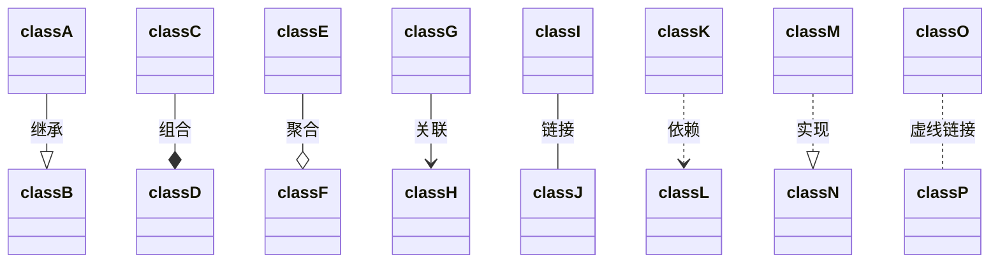
```mermaid
classDiagram
    classA --|> classB : 继承
    classC --* classD : 组合
    classE --o classF : 聚合
    classG --> classH : 关联
    classI -- classJ : 链接
    classK ..> classL : 依赖
    classM ..|> classN : 实现
    classO .. classP : 虚线链接
```

---

## 4. 状态图 State Diagram

### 基础语法

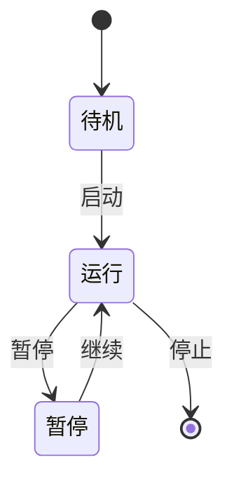
```mermaid
stateDiagram-v2
    [*] --> 待机
    待机 --> 运行 : 启动
    运行 --> 暂停 : 暂停
    暂停 --> 运行 : 继续
    运行 --> [*] : 停止
```

### 复杂状态图：订单生命周期

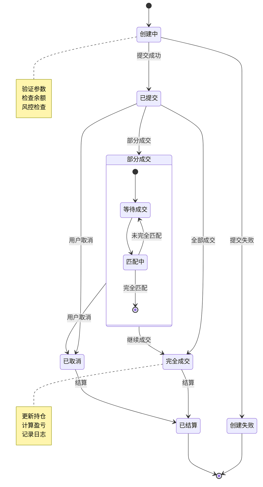
```mermaid
stateDiagram-v2
    [*] --> 创建中
    
    创建中 --> 已提交 : 提交成功
    创建中 --> 创建失败 : 提交失败
    创建失败 --> [*]
    
    已提交 --> 部分成交 : 部分成交
    已提交 --> 完全成交 : 全部成交
    已提交 --> 已取消 : 用户取消
    
    部分成交 --> 完全成交 : 继续成交
    部分成交 --> 已取消 : 用户取消
    
    完全成交 --> 已结算 : 结算
    已取消 --> 已结算 : 结算
    
    已结算 --> [*]
    
    state 部分成交 {
        [*] --> 等待成交
        等待成交 --> 匹配中
        匹配中 --> 等待成交 : 未完全匹配
        匹配中 --> [*] : 完全匹配
    }
    
    note right of 创建中
        验证参数
        检查余额
        风控检查
    end note
    
    note right of 完全成交
        更新持仓
        计算盈亏
        记录日志
    end note
```

### 并发状态

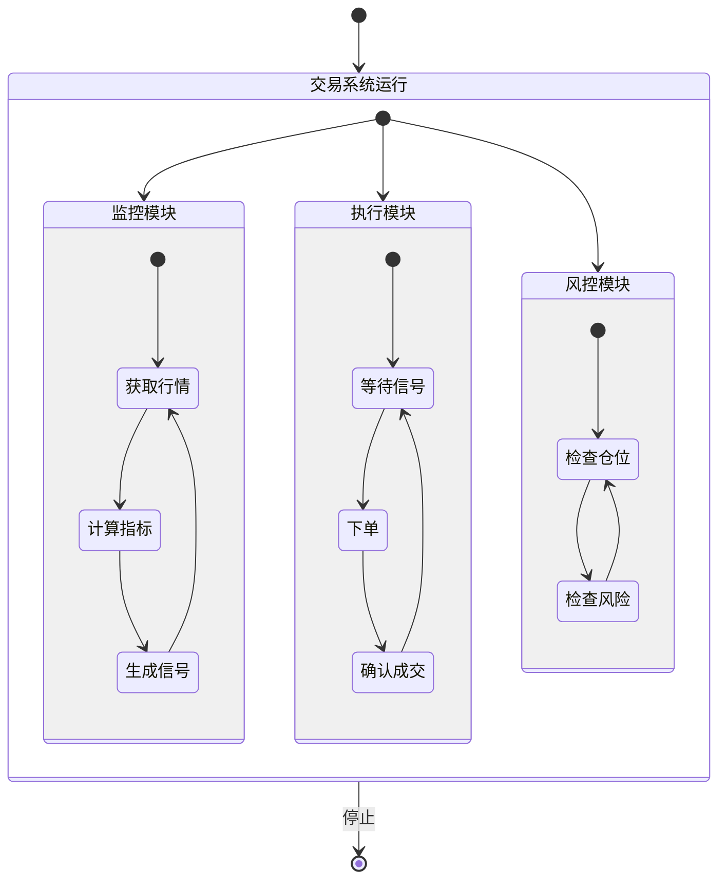
```mermaid
stateDiagram-v2
    [*] --> 交易系统运行
    
    state 交易系统运行 {
        [*] --> 监控模块
        [*] --> 执行模块
        [*] --> 风控模块
        
        state 监控模块 {
            [*] --> 获取行情
            获取行情 --> 计算指标
            计算指标 --> 生成信号
            生成信号 --> 获取行情
        }
        
        state 执行模块 {
            [*] --> 等待信号
            等待信号 --> 下单
            下单 --> 确认成交
            确认成交 --> 等待信号
        }
        
        state 风控模块 {
            [*] --> 检查仓位
            检查仓位 --> 检查风险
            检查风险 --> 检查仓位
        }
    }
    
    交易系统运行 --> [*] : 停止
```

---

## 5. 甘特图 Gantt Chart

### 基础语法

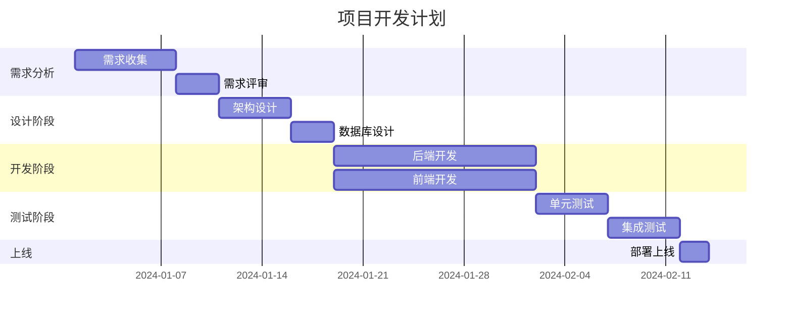
```mermaid
gantt
    title 项目开发计划
    dateFormat YYYY-MM-DD
    
    section 需求分析
    需求收集           :a1, 2024-01-01, 7d
    需求评审           :after a1, 3d
    
    section 设计阶段
    架构设计           :2024-01-11, 5d
    数据库设计         :2024-01-16, 3d
    
    section 开发阶段
    后端开发           :2024-01-19, 14d
    前端开发           :2024-01-19, 14d
    
    section 测试阶段
    单元测试           :2024-02-02, 5d
    集成测试           :2024-02-07, 5d
    
    section 上线
    部署上线           :2024-02-12, 2d
```

### 复杂甘特图：量化交易系统开发

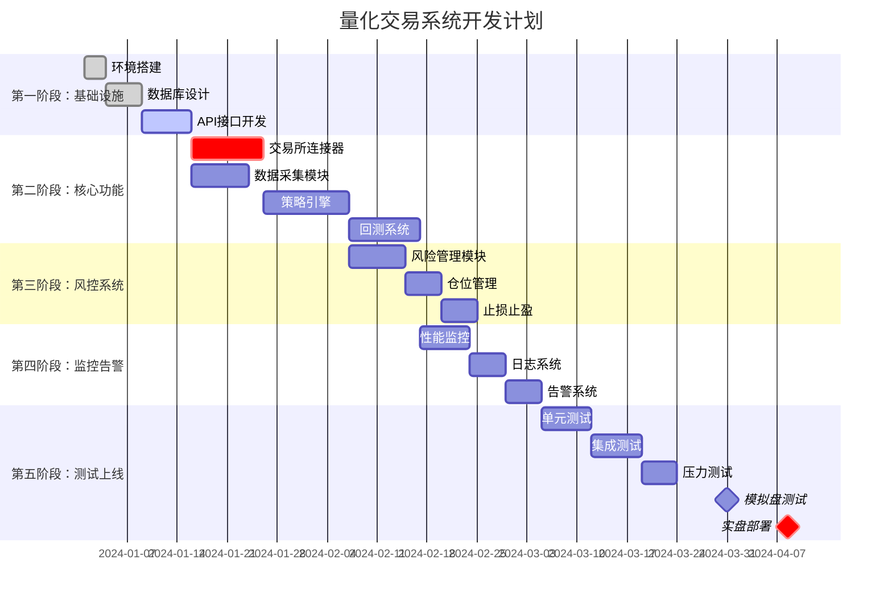
```mermaid
gantt
    title 量化交易系统开发计划
    dateFormat YYYY-MM-DD
    
    section 第一阶段：基础设施
    环境搭建           :done, env, 2024-01-01, 3d
    数据库设计         :done, db, after env, 5d
    API接口开发        :active, api, after db, 7d
    
    section 第二阶段：核心功能
    交易所连接器       :crit, conn, after api, 10d
    数据采集模块       :data, after api, 8d
    策略引擎           :strategy, after conn, 12d
    回测系统           :backtest, after strategy, 10d
    
    section 第三阶段：风控系统
    风险管理模块       :risk, after strategy, 8d
    仓位管理           :position, after risk, 5d
    止损止盈           :stoploss, after position, 5d
    
    section 第四阶段：监控告警
    性能监控           :monitor, after backtest, 7d
    日志系统           :log, after monitor, 5d
    告警系统           :alert, after log, 5d
    
    section 第五阶段：测试上线
    单元测试           :test1, after alert, 7d
    集成测试           :test2, after test1, 7d
    压力测试           :test3, after test2, 5d
    模拟盘测试         :milestone, sim, after test3, 14d
    实盘部署           :crit, milestone, prod, after sim, 3d
```

---

## 6. 饼图 Pie Chart

### 基础语法

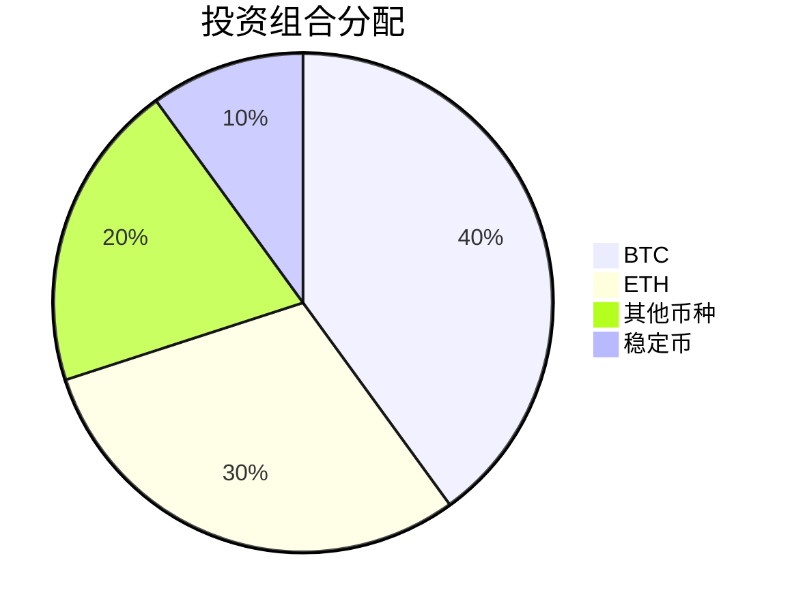
```mermaid
pie title 投资组合分配
    "BTC" : 40
    "ETH" : 30
    "其他币种" : 20
    "稳定币" : 10
```

### 详细饼图示例

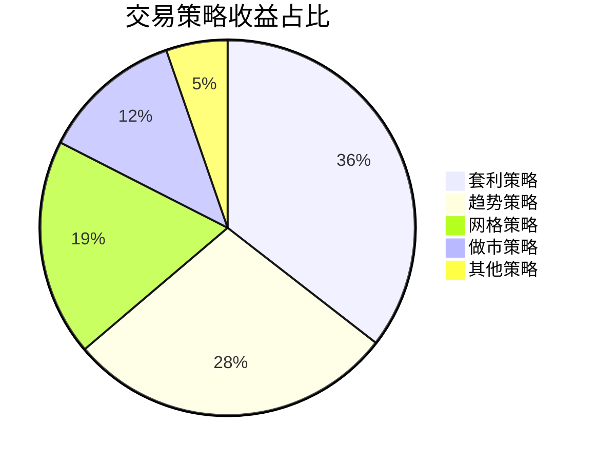
```mermaid
pie title 交易策略收益占比
    "套利策略" : 35.5
    "趋势策略" : 28.3
    "网格策略" : 18.7
    "做市策略" : 12.2
    "其他策略" : 5.3
```

---

## 7. 思维导图 Mindmap

### 基础语法

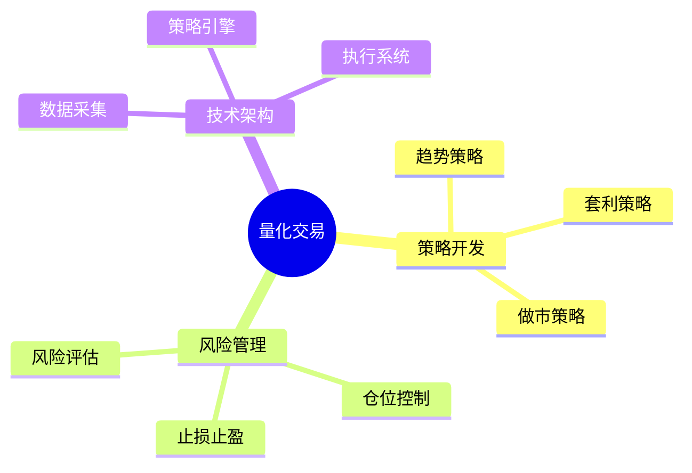
```mermaid
mindmap
  root((量化交易))
    策略开发
      趋势策略
      套利策略
      做市策略
    风险管理
      仓位控制
      止损止盈
      风险评估
    技术架构
      数据采集
      策略引擎
      执行系统
```

### 复杂思维导图：完整交易系统

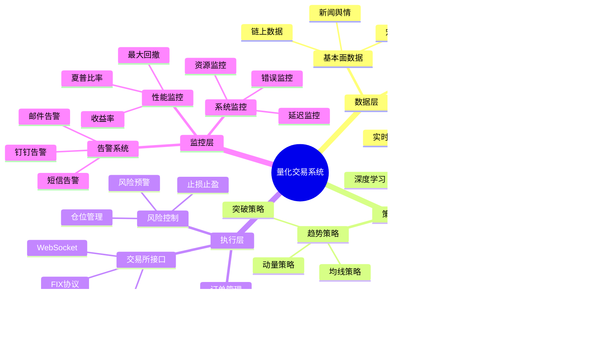
```mermaid
mindmap
  root((量化交易系统))
    数据层
      行情数据
        实时行情
        历史数据
        深度数据
      基本面数据
        链上数据
        新闻舆情
        宏观指标
      另类数据
        社交媒体
        搜索指数
        资金流向
    
    策略层
      趋势策略
        均线策略
        突破策略
        动量策略
      套利策略
        跨期套利
        跨市场套利
        统计套利
      做市策略
        网格交易
        流动性提供
        高频做市
      机器学习
        监督学习
        强化学习
        深度学习
    
    执行层
      订单管理
        订单路由
        智能拆单
        算法交易
      风险控制
        仓位管理
        止损止盈
        风险预警
      交易所接口
        REST API
        WebSocket
        FIX协议
    
    监控层
      性能监控
        收益率
        夏普比率
        最大回撤
      系统监控
        延迟监控
        错误监控
        资源监控
      告警系统
        邮件告警
        短信告警
        钉钉告警
```

---

## 8. Git 图 Git Graph

### 基础语法

```mermaid
gitGraph
    commit
    commit
    branch develop
    checkout develop
    commit
    commit
    checkout main
    merge develop
    commit
```

### 复杂 Git 工作流

```mermaid
gitGraph
    commit id: "初始化项目"
    commit id: "添加基础配置"
    
    branch develop
    checkout develop
    commit id: "开发环境搭建"
    
    branch feature/api
    checkout feature/api
    commit id: "API接口开发"
    commit id: "API测试"
    
    checkout develop
    branch feature/strategy
    commit id: "策略框架"
    commit id: "策略实现"
    
    checkout develop
    merge feature/api
    
    checkout feature/strategy
    commit id: "策略优化"
    
    checkout develop
    merge feature/strategy
    
    checkout main
    merge develop tag: "v1.0.0"
    
    checkout develop
    branch hotfix/bug
    commit id: "修复紧急bug"
    
    checkout main
    merge hotfix/bug tag: "v1.0.1"
    
    checkout develop
    merge hotfix/bug
```

---

## 9. 实体关系图 ER Diagram

### 基础语法

```mermaid
erDiagram
    USER ||--o{ ORDER : places
    ORDER ||--|{ ORDER_ITEM : contains
    PRODUCT ||--o{ ORDER_ITEM : "ordered in"
    
    USER {
        int id PK
        string name
        string email
    }
    
    ORDER {
        int id PK
        int user_id FK
        datetime created_at
    }
    
    PRODUCT {
        int id PK
        string name
        float price
    }
    
    ORDER_ITEM {
        int order_id FK
        int product_id FK
        int quantity
    }
```

### 复杂 ER 图：交易系统数据库

```mermaid
erDiagram
    USER ||--o{ STRATEGY : owns
    USER ||--o{ ORDER : creates
    USER ||--o{ POSITION : holds
    
    STRATEGY ||--o{ ORDER : generates
    STRATEGY ||--o{ BACKTEST : has
    
    ORDER ||--o{ TRADE : executes
    TRADE ||--o{ POSITION : updates
    
    EXCHANGE ||--o{ ORDER : receives
    EXCHANGE ||--o{ MARKET_DATA : provides
    
    SYMBOL ||--o{ MARKET_DATA : has
    SYMBOL ||--o{ ORDER : for
    
    USER {
        bigint id PK "用户ID"
        varchar username "用户名"
        varchar email "邮箱"
        varchar api_key "API密钥"
        datetime created_at "创建时间"
    }
    
    STRATEGY {
        bigint id PK "策略ID"
        bigint user_id FK "用户ID"
        varchar name "策略名称"
        varchar type "策略类型"
        json parameters "策略参数"
        boolean is_active "是否激活"
    }
    
    ORDER {
        bigint id PK "订单ID"
        bigint user_id FK "用户ID"
        bigint strategy_id FK "策略ID"
        varchar symbol "交易对"
        varchar side "买卖方向"
        decimal price "价格"
        decimal amount "数量"
        varchar status "订单状态"
        datetime created_at "创建时间"
    }
    
    TRADE {
        bigint id PK "成交ID"
        bigint order_id FK "订单ID"
        decimal price "成交价"
        decimal amount "成交量"
        decimal fee "手续费"
        datetime executed_at "成交时间"
    }
    
    POSITION {
        bigint id PK "持仓ID"
        bigint user_id FK "用户ID"
        varchar symbol "交易对"
        decimal amount "持仓量"
        decimal entry_price "开仓价"
        decimal unrealized_pnl "未实现盈亏"
        datetime opened_at "开仓时间"
    }
    
    EXCHANGE {
        int id PK "交易所ID"
        varchar name "交易所名称"
        varchar api_url "API地址"
        boolean is_active "是否可用"
    }
    
    MARKET_DATA {
        bigint id PK "行情ID"
        int exchange_id FK "交易所ID"
        varchar symbol "交易对"
        decimal price "价格"
        decimal volume "成交量"
        datetime timestamp "时间戳"
    }
    
    SYMBOL {
        varchar symbol PK "交易对"
        varchar base "基础货币"
        varchar quote "计价货币"
        decimal min_amount "最小数量"
        int precision "精度"
    }
    
    BACKTEST {
        bigint id PK "回测ID"
        bigint strategy_id FK "策略ID"
        date start_date "开始日期"
        date end_date "结束日期"
        decimal total_return "总收益率"
        decimal sharpe_ratio "夏普比率"
        decimal max_drawdown "最大回撤"
        datetime created_at "创建时间"
    }
```

---

## 10. 用户旅程图 User Journey

### 基础语法

```mermaid
journey
    title 用户购物旅程
    section 浏览商品
      访问网站: 5: 用户
      搜索商品: 3: 用户
      查看详情: 4: 用户
    section 下单
      加入购物车: 4: 用户
      结算: 3: 用户
      支付: 2: 用户
    section 收货
      等待发货: 2: 用户
      收到商品: 5: 用户
      评价: 4: 用户
```

### 复杂用户旅程：交易员使用系统

```mermaid
journey
    title 量化交易员日常工作流程
    section 早晨准备
      查看市场概况: 5: 交易员
      检查系统状态: 4: 交易员
      查看持仓情况: 5: 交易员
      分析昨日收益: 4: 交易员
    section 策略调整
      回测新策略: 3: 交易员
      优化参数: 2: 交易员
      模拟测试: 3: 交易员
      部署策略: 4: 交易员
    section 实时监控
      监控行情: 5: 交易员
      查看订单: 4: 交易员
      风险检查: 5: 交易员
      调整仓位: 3: 交易员
    section 收盘总结
      统计收益: 5: 交易员
      分析问题: 4: 交易员
      记录日志: 3: 交易员
      规划明日: 4: 交易员
```

---

## 高级技巧

### 1. 样式定制

```mermaid
flowchart LR
    A[开始] --> B[处理]
    B --> C[结束]
    
    style A fill:#90EE90,stroke:#333,stroke-width:4px
    style B fill:#FFD700,stroke:#333,stroke-width:2px
    style C fill:#FFB6C1,stroke:#333,stroke-width:4px
    
    classDef greenClass fill:#9f6,stroke:#333,stroke-width:2px
    classDef orangeClass fill:#f96,stroke:#333,stroke-width:4px
    
    class A greenClass
    class C orangeClass
```

### 2. 链接样式

```mermaid
flowchart LR
    A --> B
    B --> C
    C --> D
    
    linkStyle 0 stroke:#ff3,stroke-width:4px
    linkStyle 1 stroke:#f66,stroke-width:2px,stroke-dasharray: 5 5
    linkStyle 2 stroke:#0f0,stroke-width:3px
```

### 3. 图标和表情

```mermaid
flowchart LR
    A[fa:fa-user 用户] --> B[fa:fa-database 数据库]
    B --> C[fa:fa-chart-line 分析]
    C --> D[fa:fa-check 完成]
```

### 4. 子图嵌套

```mermaid
flowchart TB
    subgraph 外层系统
        subgraph 子系统A
            A1[模块1] --> A2[模块2]
        end
        
        subgraph 子系统B
            B1[模块3] --> B2[模块4]
        end
        
        A2 --> B1
    end
```

---

## 最佳实践

1. **保持简洁**：避免在一个图表中放入过多信息
2. **使用注释**：为复杂节点添加说明
3. **统一风格**：在同一项目中保持图表风格一致
4. **合理分层**：使用子图组织复杂逻辑
5. **颜色编码**：用颜色区分不同类型的节点
6. **方向选择**：
   - `TD/TB`：从上到下（适合流程图）
   - `LR`：从左到右（适合时间线）
   - `RL`：从右到左
   - `BT`：从下到上

---

## 常见问题

### Q1: 中文显示问题
确保使用 UTF-8 编码，某些渲染器可能需要额外配置。

### Q2: 图表不显示
检查语法是否正确，特别注意缩进和特殊字符。

### Q3: 箭头方向错误
检查箭头符号：`-->` 是正确的，`->` 可能不被识别。

### Q4: 节点文本换行
使用 ` ` 标签：`A[第一行 第二行]`

---

## 在线工具

- [Mermaid Live Editor](https://mermaid.live/) - 官方在线编辑器
- [GitHub](https://github.com) - 原生支持 Mermaid
- [Obsidian](https://obsidian.md/) - 笔记软件支持
- [Typora](https://typora.io/) - Markdown 编辑器支持

---

## 总结

Mermaid 是一个强大的文本驱动图表工具，适合：
- 📝 技术文档编写
- 🏗️ 系统架构设计
- 📊 数据流程展示
- 🔄 业务流程建模
- 📈 项目管理规划

通过本教程的学习，您应该能够创建各种专业的图表来支持您的量化交易系统开发！
