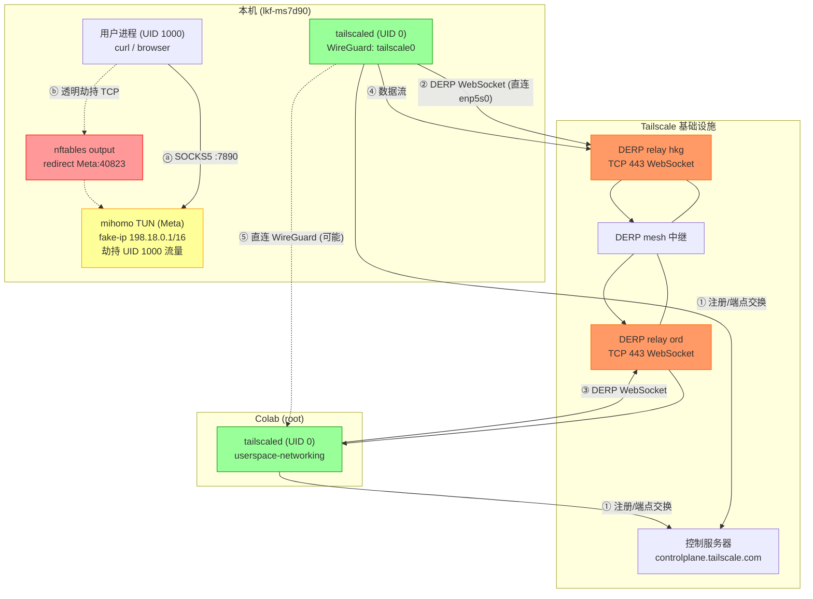

# Colab CLI

Google Colab 的命令行界面。在远程 Colab 运行时上执行代码、管理文件、编排自动化任务。

## 安装

```bash
# 依赖：GCP 认证（项目管理）
sudo pacman -S --needed --noconfirm google-cloud-cli

# colab CLI（推荐 uv）
uv tool install google-colab-cli
```

## 凭证

```bash
gcloud auth login
```

也可用 `colab auth -s <session>` 在运行时内认证 GCP 服务。

## 快速开始

```bash
# 1. 启动 CPU 会话
colab new -s mysession

# 2. 执行代码
echo "print('Hello from Colab!')" | colab exec -s mysession

# 3. 清理
colab stop -s mysession
```

## 命令索引

### 会话管理

| 命令 | 说明 |
|------|------|
| `colab new [-s NAME] [--gpu GPU] [--tpu TPU]` | 分配 CPU/GPU/TPU 运行时 |
| `colab sessions` | 列出所有活跃会话 |
| `colab status [-s NAME]` | 查看会话详情 |
| `colab stop [-s NAME]` | 终止会话并释放资源 |
| `colab url [-s NAME] [--open]` | 打印/打开浏览器连接 URL |
| `colab restart-kernel [-s NAME]` | 重启内核 |

### 代码执行

| 命令 | 说明 |
|------|------|
| `colab exec [-s NAME] [-f FILE]` | 执行 stdin / .py / .ipynb 中的代码 |
| `colab repl [-s NAME]` | 交互式 Python REPL |
| `colab console [-s NAME]` | 远程 TTY shell（tmux） |
| `colab run [--gpu GPU] [--keep] SCRIPT [ARGS...]` | 一键执行脚本并自动清理 |

### 文件操作

| 命令 | 说明 |
|------|------|
| `colab upload LOCAL REMOTE` | 上传文件 |
| `colab download REMOTE LOCAL` | 下载文件 |
| `colab ls [-s NAME] [PATH]` | 列出远程目录 |
| `colab rm [-s NAME] PATH` | 删除远程文件 |
| `colab edit [-s NAME] FILE` | 编辑远程文件 |

### 工具

| 命令 | 说明 |
|------|------|
| `colab auth [-s NAME]` | 运行时内认证 GCP |
| `colab install [-s NAME] [-r FILE \| PKG...]` | 安装 Python 包（pip/apt） |
| `colab drivemount [-s NAME] [PATH]` | 挂载 Google Drive |
| `colab log [-s NAME] [-o FILE]` | 导出笔记本日志 |
| `colab update [--install]` | 检查/升级 CLI 版本 |
| `colab whoami` | 显示当前用户 |

## 远程文件操作

```bash
# 读取（stdout）
colab exec -s "$session" <<< $'%%bash\ncat /path/to/src' > /path/to/dst

# 拉取（二进制安全）
colab exec -s "$session" <<< $'%%bash\nbase64 /path/to/src' | base64 -d > /path/to/dst

# 推送（二进制安全）
base64 /path/to/src | colab exec -s "$session" <<< $'%%bash\nbase64 -d > /path/to/dst'

# 原生 CLI（适合小文件）
colab upload /path/to/local /content/path
colab download /content/path /path/to/local
```

## 工作流：Colab + Tailscale + SSH

此工作流在 Colab 运行时上部署 tailscale，通过 tailnet SSH 直连，避免 colab console 的不稳定性。

### 1. 启动会话

```bash
session=colab-mysession
colab new -s "$session"
# colab new -s "$session" --gpu T4   # GPU
```

### 2. 部署 tailscale

```bash
colab exec -s "$session" -f usage/tailscale.sh
```

脚本自动：安装 tailscale → 以 userspace-networking 模式启动 → `tailscale up --ssh --authkey="${TS_AUTHKEY}"`。

成功标志：

```
done, ip: 100.x.x.x
```

### 3. SSH 连接

```bash
colab_ip=$(colab exec -s "$session" <<< $'%%bash\ntailscale ip -4' 2>/dev/null \
  | grep -Eo '([0-9]{1,3}\.){3}[0-9]{1,3}')
ssh root@"$colab_ip"
```

备用：

```bash
colab exec -s "$session" <<< $'%%bash\ncmd'
bash usage/colab-shell.sh "$session"
```

### 4. 关闭

```bash
colab stop -s "$session"
```

## 网络架构



| 步骤 | 路径 | 说明 |
|------|------|------|
| ① | tailscaled ↔ 控制服务器 | 注册节点、交换端点 |
| ② | local → DERP(hkg) TCP 443 | DERP WebSocket 连接，经 enp5s0 直连 |
| ③ | Colab → DERP(ord) TCP 443 | Colab 端 DERP 接入 |
| ④ | local ↔ hkg ↔ mesh ↔ ord ↔ Colab | DERP 中继数据流 |
| ⑤ | WireGuard UDP 直连 | NAT 允许时 P2P 打洞 |
| ⓐ | 用户 → mihomo :7890 | 配置代理的应用 |
| ⓑ | 用户 → nftables → mihomo TUN :40823 | 透明劫持 TCP |

### mihomo TUN 兼容性

本机 `include-uid: [1000]` 配置使 tailscaled（UID 0）绕过 TUN 劫持：

```
ip rule uidrange 0-0 → main table → enp5s0 直连
ip rule uidrange 1000-1000 → table 2022 → Meta TUN
```

若不排除 root，nftables REDIRECT 拦截 DERP WebSocket TCP 443，userspace 拆包重建破坏 WebSocket 双向帧，导致对端 `rx=0`。

## 限制

- Colab 重启后 tailscale IP 会变，每次需重新获取
- `colab console` 有已知卡死 bug，推荐 SSH 或 `colab-shell.sh`
- 免费版最长 12h，Pro 24h，Pro+ 36h
- CLI 自动 keep-alive（每 60s ping）
- Colab VM 不支持内核 WireGuard，tailscaled 使用 `--tun=userspace-networking`

## 参考

- [google-colab-cli GitHub](https://github.com/googlecolab/google-colab-cli)
- [Session Management & Keep-Alive Architecture](https://github.com/googlecolab/google-colab-cli/blob/main/docs/01_session_management.md)
- [Interactive & Non-Interactive Execution](https://github.com/googlecolab/google-colab-cli/blob/main/docs/02_execution_and_interactive.md)
- [File Management & Jupyter Contents API](https://github.com/googlecolab/google-colab-cli/blob/main/docs/03_file_management.md)
- [Authentication Providers & VM Automation](https://github.com/googlecolab/google-colab-cli/blob/main/docs/04_automation_and_utility.md)
- [Ephemeral Job Runner Design](https://github.com/googlecolab/google-colab-cli/blob/main/docs/05_run_command.md)
